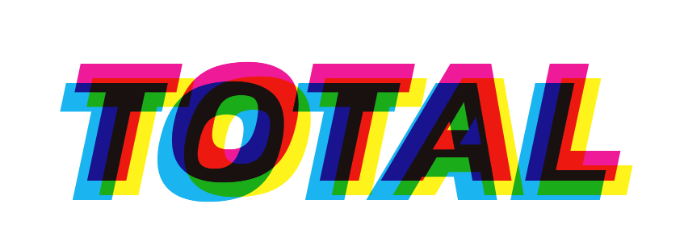

# Recréation de la pochette d'album "Total" : superposition typographique avec `mix-blend-mode`

## Description
Exercice d’exploration de la propriété CSS `mix-blend-mode` pour créer un effet de superposition colorée sur du texte.
L'objectif était de recréer le visuel de la pochette de l'album "Total: From Joy Division to New Order".
La page affiche trois couches de texte "Total" en couleurs différentes, avec un effet de mélange visuel.  
La référence visuelle est placée dans le footer sous forme d’une image de la pochette d’album originale.

---

## Technologies utilisées  
- HTML5 (structure sémantique simple)  
- CSS3 (notamment `mix-blend-mode`, positionnement absolu et relatif)  
- Google Fonts (police Kanit, style gras italique), la police la plus proche du style de l’album que j’ai pu trouver.

---

## Aperçu

---

## Demo

[Voir la démo sur GitHub Pages](https://rukendogan.github.io/total-album-cover/)

---

## Ce que j’ai appris  
- Utiliser `mix-blend-mode` pour créer des effets de superposition visuelle  
- Jouer avec le positionnement CSS (`relative` et `absolute`) pour décaler les couches  

---

## Structure HTML particulière  
- Le contenu principal (texte superposé) est dans le `<body>`  
- La référence image et sa légende sont dans le `<footer>`, soulignant qu’il s’agit d’un contenu annexe  

---
